# 📝 Noto - AI-Powered Personal Note-Taking

[](https://opensource.org/licenses/MIT)
[](https://fastapi.tiangolo.com/)
[](https://reactnative.dev/)
[](https://huggingface.co/)

**Noto** is a modern, full-stack note-taking application that leverages advanced AI models to help you manage, summarize, and understand your notes better. Whether you're a student, a researcher, or a professional, Noto provides the tools to turn your raw thoughts into structured insights.

---

## 🚀 Key Features

- **Smart Summarization**: Automatically condense long notes into concise, human-friendly summaries using the `google/pegasus-xsum` model.
- **AI Explanations**: Deepen your understanding with two explanation modes:
  - **Simple**: For a beginner-friendly, jargon-free overview.
  - **Technical**: For a detailed, conceptual breakdown.
- **Cross-Platform Mobile App**: Seamless experience on both Android and iOS built with React Native.
- **Secure Authentication**: Robust user management and JWT-based authentication powered by `fastapi-users`.
- **Intelligent Caching**: AI-generated content is cached in the database to ensure fast retrieval and reduce computational overhead.
- **Image Management**: Seamless image uploads and optimizations using [ImageKit](https://imagekit.io/).

---

## 🛠️ Project Structure

<p align="center">
  
</p>

The project is divided into two main components:

- **[`noto_server`](./noto_server)**: The backend API built with FastAPI, handling data persistence and AI model execution.
- **[`noto_mobile`](./noto_mobile)**: The cross-platform mobile application built with React Native and TypeScript.

---

## ⚙️ Setup & Installation

### 1. Backend Setup (`noto_server`)

**Prerequisites**: Python 3.10+, Virtualenv

```bash
# Clone the repository
git clone https://github.com/akashbera009/Noto
cd Noto

# Create and activate virtual environment
python -m venv venv
source venv/bin/activate

# Install dependencies
pip install -r requirement.txt

# Configure Environment Variables
# Create a .env file in the root
# Add the following:
# DATABASE_URL=your_database_url
# HUGGING_FACE_TOKEN=your_hf_token
# IMAGEKIT_PUBLIC_KEY=your_public_key
# IMAGEKIT_PRIVATE_KEY=your_private_key
# IMAGEKIT_URL=your_url_endpoint
```

**AI Model Configuration**:
To use the local models, ensure you have sufficient RAM (at least 8GB recommended).
```bash
# Log in to Hugging Face
hf auth login
# Provide your token: HUGGING_FACE_TOKEN
```

**Run the Server**:
```bash
cd noto_server
uvicorn main:app --reload
```

### 2. Mobile Setup (`noto_mobile`)

**Prerequisites**: Node.js, Yarn, React Native CLI, Android Studio / Xcode

```bash
cd noto_mobile

# Install dependencies
yarn install

# For iOS (macOS only)
cd ios && pod install && cd ..

# Start Metro Bundler
yarn start

# Run on Android
yarn android

# Run on iOS
yarn ios
```

---

## 🤖 AI Models Used

Noto utilizes state-of-the-art models from the Hugging Face ecosystem:

- **Summarization**: `google/pegasus-xsum` - Optimized for generating high-quality abstractive summaries.
- **Explanation & Refinement**: `google/flan-t5-large` - A versatile text-to-text model used for generating detailed explanations and refining raw summaries into natural language.

---

## 🗄️ Tech Stack

- **Backend**: FastAPI, SQLAlchemy (Async), PostgreSQL/SQLite, Alembic.
- **Mobile**: React Native, TypeScript, React Navigation, Axios.
- **AI/ML**: Hugging Face Transformers, Local LLMs.

---

## 📄 License

Distributed under the MIT License. See `LICENSE` for more information.

---

*Made with ❤️ for better note-taking.*
